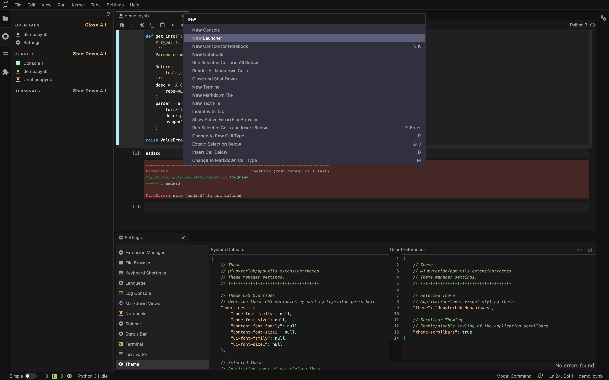

# Henanigans Theme for JupyterLab

A dark, easy-on-the-eyes theme for JupyterLab.



---


## Requirements

* JupyterLab >= 3.0

## Install

To install the extension, execute:

```bash
pip install jupyterlab_henanigans
```

## Uninstall

To remove the extension, execute:

```bash
pip uninstall jupyterlab_henanigans
```


## Contributing

### Development install

Note: You will need NodeJS to build the extension package.

The `jlpm` command is JupyterLab's pinned version of
[yarn](https://yarnpkg.com/) that is installed with JupyterLab. You may use
`yarn` or `npm` in lieu of `jlpm` below.

```bash
# Clone the repo to your local environment
# Change directory to the jupyterlab_henanigans directory
# Install package in development mode
pip install -e .
# Link your development version of the extension with JupyterLab
jupyter labextension develop . --overwrite
# Rebuild extension Typescript source after making changes
jlpm run build
```

You can watch the source directory and run JupyterLab at the same time in different terminals to watch for changes in the extension's source and automatically rebuild the extension.

```bash
# Watch the source directory in one terminal, automatically rebuilding when needed
jlpm run watch
# Run JupyterLab in another terminal
jupyter lab
```

With the watch command running, every saved change will immediately be built locally and available in your running JupyterLab. Refresh JupyterLab to load the change in your browser (you may need to wait several seconds for the extension to be rebuilt).

By default, the `jlpm run build` command generates the source maps for this extension to make it easier to debug using the browser dev tools. To also generate source maps for the JupyterLab core extensions, you can run the following command:

```bash
jupyter lab build --minimize=False
```

### Development uninstall

```bash
pip uninstall jupyterlab_henanigans
```

In development mode, you will also need to remove the symlink created by `jupyter labextension develop`
command. To find its location, you can run `jupyter labextension list` to figure out where the `labextensions`
folder is located. Then you can remove the symlink named `@theNewFlesh/jupyterlab_henanigans` within that folder.

### Docker
1. Install
   [docker](https://docs.docker.com/v17.09/engine/installation)
2. Install
   [docker-machine](https://docs.docker.com/machine/install-machine)
   (if running on macOS or Windows)
3. `docker pull theNewFlesh/jupyterlab_henanigans:[version]`
4. `docker run --rm --name jupyterlab_henanigans-prod --publish 1180:80 theNewFlesh/jupyterlab_henanigans:[version]`

### Docker For Developers
1. Install
   [docker](https://docs.docker.com/v17.09/engine/installation)
2. Install
   [docker-machine](https://docs.docker.com/machine/install-machine)
   (if running on macOS or Windows)
3. Ensure docker-machine has at least 4 GB of memory allocated to it.
4. `git clone git@github.com:theNewFlesh/jupyterlab_henanigans.git`
5. `cd jupyterlab_henanigans`
6. `chmod +x bin/jupyterlab_henanigans`
7. `bin/jupyterlab_henanigans start`

The service should take a few minutes to start up.

Run `bin/jupyterlab_henanigans --help` for more help on the command line tool.
