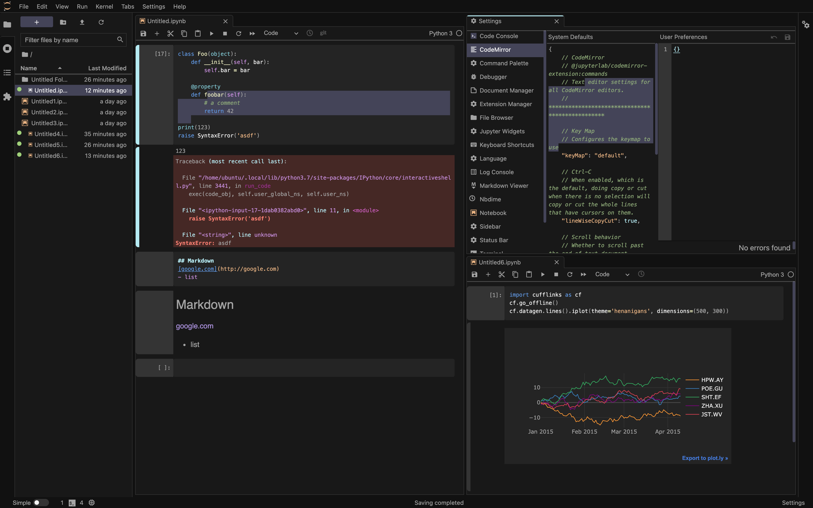

# Henanigans for JupyterLab

A dark, easy-on-the-eyes theme.



---

## Requires

* JupyterLab 3.0+

## Installation

As with any JupyterLab extension, a rebuild will be necessary after installing this theme. Each of the installation methods below will automatically prompt for a rebuild.

### Terminal

```bash
jupyter labextension install jupyterlab_henanigans
```

### JupyterLab UI

1. Open JupyterLab
2. Click on Extensions tab in sidebar (puzzle piece)
3. Enable Extensions (if not done already)
4. Seach for `henanigans`
5. Click `Install` under `jupyterlab_henanigans`
6. Follow the prompts to rebuild JupyterLab

## Development

For a development install (requires npm version 4 or later), do the following in the repository directory:

```bash
npm install
jupyter labextension link .
```

To rebuild the package and the JupyterLab app:

```bash
npm run build
jupyter lab build
```
